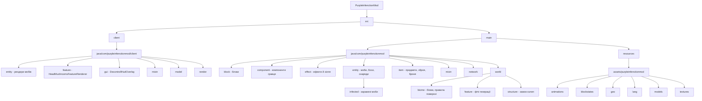

<h1 align="center">PurpleInfectionMod</h1>


<!-- TODO: заміни на реальний GIF/скріншот, коли він буде готовий -->

<a name="contents"><h3>Зміст</h3></a>

# Опис проєкту
<h5>Project description</h5>

[Опис проєкту](#description)

# Інформація про команду
<h5>Information about our team</h5>

[Інформація про команду](#team)

# Встановлення та запуск
<h5>Installation and launch</h5>

[Встановлення та запуск](#launch)

# Структура проєкту
<h5>Program structure</h5>

[Структура проєкту](#structure)

# Опис модулів
<h5>Modules Description</h5>

[Опис модулів](#modules)

# Проблеми під час розробки
<h5>Problems during project development</h5>

[Проблеми під час розробки](#problem_project)

# Висновок
<h5>Conclusion</h5>

[Висновок](#conclusion)

---

<a name="description"><h1>Опис проєкту</h1></a>

Колись ці землі були спокійним і прекрасним місцем. Ліси, будинки та маєтки оточували древній вогняний кристал, схований глибоко під землею. Він був джерелом сили, що захищала жителів і зберігала рівновагу.

Але одного разу хтось спробував заволодіти його могутністю. Кристал не вдалося знищити, проте на ньому з'явилась тріщина, і більша частина його сили була втрачена. Залишившись без захисту, землі поступово захопили загадкові гриби. Вони поширились лісами та печерами, заразили рослини та підкорили собі місцевих жителів, перетворивши їх на стражів заражених маєтків.

Відтоді ці місця стали небезпечними. Спори заражають кожного, хто занадто довго перебуває серед них, а гриби здатні впливати на розум і поступово брати під контроль живих істот. Єдиним захистом від зараження стає спеціальний респіратор.

Але одного разу, під час дивного спорового дощу, древній кристал знову подає сигнал. Серед заражених земель з'являється таємничий замок-склеп, всередині якого знаходяться уламки кристала та речі, здатні допомогти в боротьбі з інфекцією.

Герою належить пробитися крізь заражених стражів, дістатись до кристала та зразитись з істотою, що охороняє його. Перемігши боса, він зможе зібрати уламки, створити нову зброю та броню, а головне — відновити силу кристала.

Отримавши його благословення, герой більше не боїться зараження, стає сильнішим і отримує здатність поглинати життєву силу своїх ворогів.

Але чи зможе він очистити ці землі остаточно — і хто насправді стояв за пошкодженням кристала?

**PurpleInfectionMod** — це мод для Minecraft, створений на базі мод-лоадера Fabric мовою Java. Мод додає нову заражену екосистему (біом, блоки, руди, рослинність), лінійку заражених і грибних мобів, боса Rotting Spore Fungus, систему захисту через респіратори, кристальну зброю та броню, а також структуру замку-склепу з унікальною механікою.

<details>
<summary> English version </summary>

Once these lands were a calm and beautiful place. Forests, houses and manors surrounded an ancient fire crystal, hidden deep underground. It was a source of power that protected the inhabitants and maintained balance.

But one day someone tried to seize its power. The crystal could not be destroyed, but a crack appeared on it, and most of its power was lost. Left without protection, the lands were gradually taken over by mysterious mushrooms. They spread through the forests and caves, infected plants and subjugated the local inhabitants, turning them into guardians of the infected manors.

Since then, these places have become dangerous. Spores infect anyone who stays among them too long, and the mushrooms are able to influence the mind and gradually take control of living creatures. The only protection against infection is a special respirator.

But one day, during a strange spore rain, the ancient crystal sends a signal again. A mysterious crypt-castle appears among the infected lands, inside which are fragments of the crystal and items that can help in the fight against the infection.

The hero must break through the infected guardians, reach the crystal and fight the creature guarding it. Having defeated the boss, he will be able to collect the fragments, create new weapons and armor, and most importantly — restore the power of the crystal.

Having received its blessing, the hero no longer fears infection, becomes stronger and gains the ability to absorb the life force of his enemies.

But will he be able to cleanse these lands completely — and who really stood behind the damage to the crystal?

**PurpleInfectionMod** is a Minecraft mod built on the Fabric mod loader in Java. The mod adds a new infected ecosystem (biome, blocks, ores, vegetation), a line of infected and mushroom mobs, the Rotting Spore Fungus boss, a protection system through respirators, crystal weapons and armor, as well as a crypt-castle structure with unique mechanics.

</details>

[Повернутись до змісту](#contents)

<a name="team"><h1>Інформація про команду</h1></a>

1. GitHub - [Diana - Team Lead, 3D Modeler, Backend Developer](https://github.com/dianaaao)
2. GitHub - [Illya - Developer (Backend, World Generation, Effects)](https://github.com/IllyaEpik)
3. GitHub - [David - Texture Artist, Developer (Weapons Logic, Project Structure)](https://github.com/Davidptn)

[Повернутись до змісту](#contents)

<a name="launch"><h1>Встановлення та запуск</h1></a>

Мод створений на Fabric (Minecraft 1.20.1) і потребує кількох додаткових бібліотек-модів для коректної роботи.

**1. Збірка мода з коду:**

```bash
./gradlew build
```

Після успішної збірки готовий `.jar`-файл мода з'явиться у папці `build/libs/`.

**2. Встановлення в гру:**

1. Встанови [Fabric Loader](https://fabricmc.net/use/) для потрібної версії Minecraft.
2. Скопіюй зібраний `purpleinfenctionmod-*.jar` у папку `.minecraft/mods`.
3. Додай у ту саму папку обов'язкові залежності мода:
   - `fabric-api`
   - `cardinal-components-api`
   - `geckolib`
   - `TerraBlender-fabric`
4. За бажанням можна додати опційні/сумісні моди:
   - `sodium-fabric` — оптимізація рендеру
   - `jei-fabric` — довідник предметів і рецептів
   - `e4mc-fabric` — покращення з'єднання по мережі
   - `tl_skin_cape_fabric` — підтримка плащів/скінів

<details>
<summary> English version </summary>

The mod is built on Fabric (Minecraft 1.20.1) and requires several additional library mods to work correctly.

**1. Building the mod from source:**

```bash
./gradlew build
```

After a successful build, the ready `.jar` file of the mod will appear in the `build/libs/` folder.

**2. Installing into the game:**

1. Install [Fabric Loader](https://fabricmc.net/use/) for the required Minecraft version.
2. Copy the built `purpleinfenctionmod-*.jar` into the `.minecraft/mods` folder.
3. Add the mod's required dependencies to the same folder:
   - `fabric-api`
   - `cardinal-components-api`
   - `geckolib`
   - `TerraBlender-fabric`
4. Optionally, you can add compatible/optional mods:
   - `sodium-fabric` — rendering optimization
   - `jei-fabric` — item and recipe reference
   - `e4mc-fabric` — network connection improvements
   - `tl_skin_cape_fabric` — skin/cape support

</details>

[Повернутись до змісту](#contents)

<a name="structure"><h1>Структура проєкту</h1></a>



<details>
<summary>Детальніше про папки java/com/purpleinfenctionmod</summary>

- `block/` — заражені блоки, руди, кастомні блоки з унікальною логікою (наприклад, `InfectedCaveVinesBlock`, `InfectedGrassBlock`)
- `component/` — Cardinal Components API: зберігання "зараженої сили" гравця (`PlayerInfectedPowerComponent`)
- `effect/` — власні статус-ефекти та зілля (`InfectedLookEffect`, `ModPotions`)
- `entity/` — усі сутності мода: гриби-моби, снаряди, кристали, боси
  - `entity/infected/` — заражені версії ванільних мобів (зомбі, скелет, крипер) та логіка зараження (`InfectionHandler`)
- `item/` — предмети, зброя, броня, спавн-яйця
- `mixin/` — втручання в ванільний код гри (розміщення блоків, сутності, генерація поверхні)
- `network/` — мережева синхронізація клієнт-сервер
- `world/` — все, що пов'язано зі світом:
  - `biome/` — заражений біом, правила поверхні, модифікатори біомів, кільцевий джерело біомів
  - `feature/` — фічі генерації (лози, лишайники тощо)
  - `structure/` — структура замку-склепу та її нічна механіка

</details>

[Посилання на структуру проєкту (Figma)](#)
<!-- TODO: додай посилання на Figma-схему, якщо буде створена -->

[Повернутись до змісту](#contents)

<a name="modules"></a>
<h2>Ключова логіка мода</h2>

Нижче наведено кілька невеликих, але показових фрагментів коду, які демонструють основні механіки бекенду мода.

<h3>PurpleInfenctionMod.java — точка входу мода</h3>
Головний клас мода реєструє всі підсистеми (блоки, предмети, ефекти, сутності, структури) під час запуску гри та підписується на серверні події.

```java
@Override
public void onInitialize() {

    GeckoLib.initialize();

    ModBlocks.registerModBlocks();
    ModItems.registerModItems();
    ModItemGroups.registerItemGroups();

    ModEffects.registerEffects();
    ModPotions.registerPotions();

    ModFeatures.registerFeatures();
    ModStructures.registerStructures();
    ModBiomeModifiers.register();

    registerEntityAttributes();

    InfectionHandler.register();
    PlacedBlockDecayHandler.register();
    MushroomBreakHandler.register();
    PoisonCloudManager.register();

    registerServerEvents();

    LOGGER.info("Purple Infection Mod initialized.");
}
```

Такий підхід дозволяє тримати ініціалізацію структурованою: кожна підсистема (блоки, предмети, ефекти, сутності, світ) реєструється окремим методом, що спрощує підтримку коду.

<h3>ModItems.java — реєстрація предметів</h3>
Усі предмети мода реєструються через єдиний реєстр Minecraft за допомогою допоміжного методу `registerItem`, що уникає дублювання коду.

```java
private static Item registerItem(String name, Item item){
    return Registry.register(
        Registries.ITEM,
        PurpleInfenctionMod.id(name),
        item
    );
}
```

Далі кожен предмет розподіляється по відповідних вкладках творчого режиму (зброя — у бойову вкладку, їжа — у вкладку їжі тощо) через `ItemGroupEvents`.

<h3>InfectionWorldState.java — збереження стану світу</h3>
Для зберігання глобального прогресу гри (наприклад, чи виправлений кристал) використовується `PersistentState` — механізм Minecraft для збереження даних світу в NBT.

```java
public class InfectionWorldState extends PersistentState {

    private boolean crystalFixed = false;

    public boolean isCrystalFixed() {
        return crystalFixed;
    }

    public void setCrystalFixed(boolean value) {
        this.crystalFixed = value;
        markDirty();
    }

    public static InfectionWorldState get(ServerWorld world) {
        PersistentStateManager manager = world.getPersistentStateManager();
        return manager.getOrCreate(
                InfectionWorldState::fromNbt,
                InfectionWorldState::new,
                "purpleinfenctionmod_infection"
        );
    }
}
```

Такий підхід гарантує, що прогрес проходження сюжету (виправлення кристала) зберігається між сесіями гри окремо для кожного світу.

<h3>ModBiomes.java — реєстрація зараженого біома</h3>
Ключ біома реєструється окремо від самого біома — сам біом створюється грою динамічно через дата-пак/генератор, а `RegistryKey` використовується для посилання на нього з коду (правила поверхні, модифікатори, спавн мобів).

```java
public class ModBiomes {
    public static final RegistryKey<Biome> INFECTED_KEY = RegistryKey.of(
        RegistryKeys.BIOME,
        new Identifier(PurpleInfenctionMod.MOD_ID, "infected")
    );
}
```

<h3>RottingSporeFungusEntity.java — фазова система боса</h3>
Бос `Rotting Spore Fungus` змінює поведінку залежно від відсотка здоров'я: чим менше здоров'я, тим частіше він атакує та призиває мінйонів.

```java
private void updatePhase() {
    float healthRatio = this.getHealth() / this.getMaxHealth();
    int newPhase;

    if (healthRatio > 0.66f) {
        newPhase = 1;
    } else if (healthRatio > 0.33f) {
        newPhase = 2;
    } else {
        newPhase = 3;
    }

    if (newPhase != currentPhase) {
        currentPhase = newPhase;
        onPhaseChanged();
    }
}
```

Кулдауни атак і призову мінйонів також залежать від поточної фази:

```java
private int getRangedCooldownTicks() {
    return switch (currentPhase) {
        case 1 -> 100; // 5 сек
        case 2 -> 70;  // 3.5 сек
        default -> 40; // 2 сек
    };
}
```

Завдяки цьому бій з босом стає динамічнішим і складнішим у міру того, як гравець завдає йому шкоди.

[Повернутись до змісту](#contents)

<a name="problem_project"><h2>Проблеми під час розробки</h2></a>

У процесі створення PurpleInfectionMod виникло кілька організаційних і технічних труднощів.

<h3>Нестача людей у команді.</h3>
Над проєктом активно працювала лише невелика частина команди, через що навантаження розподілялось нерівномірно, а частину задач доводилось відкладати або переносити на пізніші етапи.

<h3>Брак часу.</h3>
Обмежені терміни змушували пріоритизувати найважливіші механіки та контент, залишаючи менш критичні ідеї на майбутнє.

<h3>Робота з 3D-моделями, доданими вручну.</h3>
Створення власних мобів і предметів (боса, заражених мобів, зброї) вимагало опанування нових навичок 3D-моделювання та анімації (GeckoLib), оскільки готових рішень для унікального контенту не існувало. Виникали помилки в анімаціях та невідповідність моделей хітбоксам.

<h3>Проблеми з генерацією світу та навантаженням на сервер.</h3>
Кастомна генерація зараженого біома (додаткові руди, правила поверхні, фічі) створювала додаткове навантаження на сервер, що іноді призводило до просідань продуктивності при генерації нових чанків.

Ці проблеми вирішувались поступово: команда заздалегідь планувала послідовність задач, що дозволило встигнути реалізувати більшу частину контенту, помилки виправлялись одразу після виявлення, а генерація світу оптимізувалась для зменшення навантаження на сервер.

<details>
<summary> English version </summary>

Several organizational and technical difficulties arose during the development of PurpleInfectionMod.

<h3>Lack of team members.</h3>
Only a small part of the team was actively working on the project, which led to uneven workload distribution and forced some tasks to be postponed or moved to later stages.

<h3>Lack of time.</h3>
Limited deadlines forced the team to prioritize the most important mechanics and content, leaving less critical ideas for the future.

<h3>Working with manually added 3D models.</h3>
Creating custom mobs and items (the boss, infected mobs, weapons) required mastering new 3D modeling and animation skills (GeckoLib), since no ready-made solutions existed for unique content. Errors occurred in animations and mismatches between models and hitboxes.

<h3>World generation and server load issues.</h3>
Custom generation of the infected biome (additional ores, surface rules, features) created additional load on the server, which sometimes led to performance drops when generating new chunks.

These problems were gradually resolved: the team planned the sequence of tasks in advance, which allowed most of the content to be implemented in time, errors were fixed as soon as they were found, and world generation was optimized to reduce server load.

</details>

[Повернутись до змісту](#contents)

<a name="conclusion"><h2>Висновок</h2></a>

У результаті розробки PurpleInfectionMod було створено повноцінний мод для Minecraft на Fabric мовою Java, що додає власну заражену екосистему: біом, блоки, руди, ворожих і дружніх мобів, боса з фазовою системою, систему захисту через респіратори, кристальну зброю та броню, а також структуру замку-склепу з унікальним сюжетом. У процесі розробки команда здобула практичні навички роботи з Fabric API, GeckoLib, Cardinal Components API, генерацією світу (біоми, фічі, структури), а також з 3D-моделюванням і анімацією. Незважаючи на труднощі з обмеженою кількістю учасників, часом та оптимізацією, вдалося реалізувати більшість запланованого контенту. У результаті вийшов цікавий мод, в який команда із задоволенням грає сама, а отриманий досвід командної розробки на Java відкриває можливості як для подальшого вдосконалення проєкту, так і для потенційного заробітку. У майбутньому команда планує довести ідею до завершення, покращити оптимізацію та, можливо, розробити покращену версію мода.

<details>
<summary> English version </summary>

As a result of developing PurpleInfectionMod, a full-fledged Minecraft mod was created on Fabric in Java, adding its own infected ecosystem: a biome, blocks, ores, hostile and friendly mobs, a boss with a phase system, a protection system through respirators, crystal weapons and armor, as well as a crypt-castle structure with a unique storyline. During development, the team gained practical skills in working with the Fabric API, GeckoLib, Cardinal Components API, world generation (biomes, features, structures), as well as 3D modeling and animation. Despite difficulties with a limited number of participants, time, and optimization, most of the planned content was successfully implemented. The result is an interesting mod that the team enjoys playing themselves, and the experience gained in Java team development opens up opportunities both for further improvement of the project and for potential earnings. In the future, the team plans to bring the idea to completion, improve optimization, and possibly develop an improved version of the mod.

</details>

[Повернутись до змісту](#contents)
