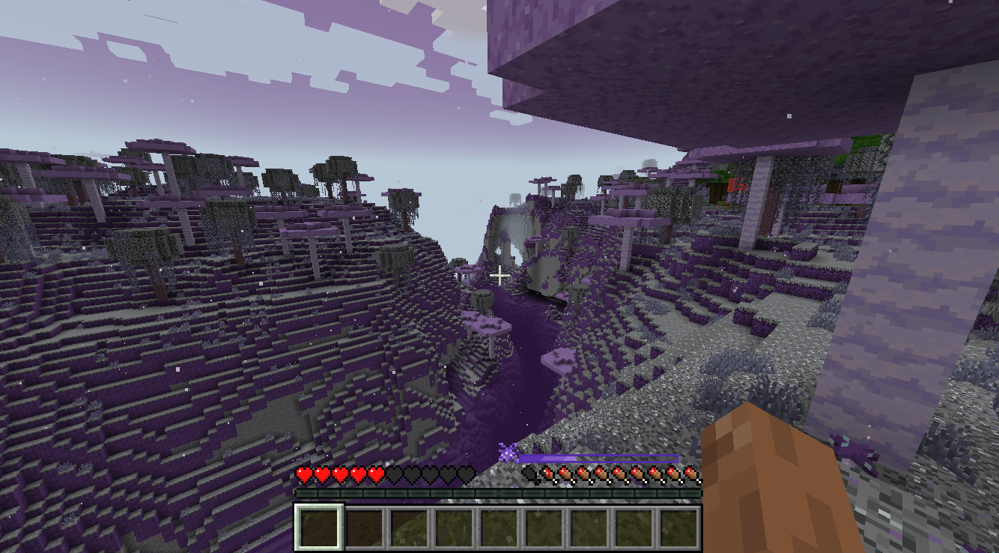
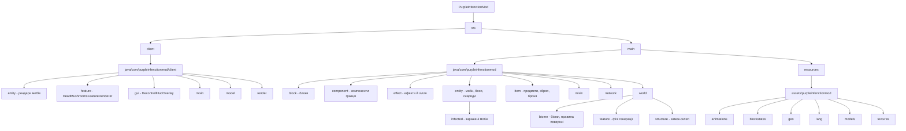

<h1 align="center">PurpleInfectionMod</h1>



<a name="contents"><h3>Зміст</h3></a>

# Опис проєкту
<h5>Project description</h5>

[Опис проєкту](#description)

# Інформація про команду
<h5>Information about our team</h5>

[Інформація про команду](#team)

# Встановлення та запуск
<h5>Installation and launch</h5>

[Встановлення та запуск](#launch)

# Структура проєкту
<h5>Program structure</h5>

[Структура проєкту](#structure)

# Опис модулів
<h5>Modules Description</h5>

[Опис модулів](#modules)

# Проблеми під час розробки
<h5>Problems during project development</h5>

[Проблеми під час розробки](#problem_project)

# Корисні посилання
<h5>Useful links</h5>

[Корисні посилання](#links)

# Висновок
<h5>Conclusion</h5>

[Висновок](#conclusion)

---

<a name="description"><h1>Опис проєкту</h1></a>

Колись ці землі були спокійним і прекрасним місцем. Ліси, будинки та маєтки оточували древній вогняний кристал, схований глибоко під землею. Він був джерелом сили, що захищала жителів і зберігала рівновагу.

Але одного разу хтось спробував заволодіти його могутністю. Кристал не вдалося знищити, проте на ньому з'явилась тріщина, і більша частина його сили була втрачена. Залишившись без захисту, землі поступово захопили загадкові гриби. Вони поширились лісами та печерами, заразили рослини та підкорили собі місцевих жителів, перетворивши їх на стражів заражених маєтків.

Відтоді ці місця стали небезпечними. Спори заражають кожного, хто занадто довго перебуває серед них, а гриби здатні впливати на розум і поступово брати під контроль живих істот. Єдиним захистом від зараження стає спеціальний респіратор.

Але одного разу, під час дивного спорового дощу, древній кристал знову подає сигнал. Серед заражених земель з'являється таємничий замок-склеп, всередині якого знаходяться уламки кристала та речі, здатні допомогти в боротьбі з інфекцією.

Герою належить пробитися крізь заражених стражів, дістатись до кристала та зразитись з істотою, що охороняє його. Перемігши боса, він зможе зібрати уламки, створити нову зброю та броню, а головне — відновити силу кристала.

Отримавши його благословення, герой більше не боїться зараження, стає сильнішим і отримує здатність поглинати життєву силу своїх ворогів.

Але чи зможе він очистити ці землі остаточно — і хто насправді стояв за пошкодженням кристала?

**PurpleInfectionMod** — це мод для Minecraft, створений на базі мод-лоадера Fabric мовою Java. Мод додає нову заражену екосистему (біом, блоки, руди, рослинність), лінійку заражених і грибних мобів, боса Rotting Spore Fungus, систему захисту через респіратори, кристальну зброю та броню, а також структуру замку-склепу з унікальною механікою.

<details>
<summary> English version </summary>

Once these lands were a calm and beautiful place. Forests, houses and manors surrounded an ancient fire crystal, hidden deep underground. It was a source of power that protected the inhabitants and maintained balance.

But one day someone tried to seize its power. The crystal could not be destroyed, but a crack appeared on it, and most of its power was lost. Left without protection, the lands were gradually taken over by mysterious mushrooms. They spread through the forests and caves, infected plants and subjugated the local inhabitants, turning them into guardians of the infected manors.

Since then, these places have become dangerous. Spores infect anyone who stays among them too long, and the mushrooms are able to influence the mind and gradually take control of living creatures. The only protection against infection is a special respirator.

But one day, during a strange spore rain, the ancient crystal sends a signal again. A mysterious crypt-castle appears among the infected lands, inside which are fragments of the crystal and items that can help in the fight against the infection.

The hero must break through the infected guardians, reach the crystal and fight the creature guarding it. Having defeated the boss, he will be able to collect the fragments, create new weapons and armor, and most importantly — restore the power of the crystal.

Having received its blessing, the hero no longer fears infection, becomes stronger and gains the ability to absorb the life force of his enemies.

But will he be able to cleanse these lands completely — and who really stood behind the damage to the crystal?

**PurpleInfectionMod** is a Minecraft mod built on the Fabric mod loader in Java. The mod adds a new infected ecosystem (biome, blocks, ores, vegetation), a line of infected and mushroom mobs, the Rotting Spore Fungus boss, a protection system through respirators, crystal weapons and armor, as well as a crypt-castle structure with unique mechanics.

</details>

[Повернутись до змісту](#contents)

<a name="team"><h1>Інформація про команду</h1></a>

1. GitHub - [Diana - Team Lead, 3D Modeler, Backend Developer](https://github.com/dianaaao)
2. GitHub - [Illya - Developer (Backend, World Generation, Effects)](https://github.com/IllyaEpik)
3. GitHub - [David - Texture Artist, Developer (Weapons Logic, Project Structure)](https://github.com/Davidptn)

[Повернутись до змісту](#contents)

<a name="launch"><h1>Встановлення та запуск</h1></a>

Мод створений на Fabric (Minecraft 1.20.1) і потребує кількох додаткових бібліотек-модів для коректної роботи.

**1. Збірка мода з коду:**

```bash
./gradlew build
```

Після успішної збірки готовий `.jar`-файл мода з'явиться у папці `build/libs/`.

**2. Встановлення в гру:**

1. Встанови [Fabric Loader](https://fabricmc.net/use/) для потрібної версії Minecraft.
2. Скопіюй зібраний `purpleinfenctionmod-*.jar` у папку `.minecraft/mods`.
3. Додай у ту саму папку обов'язкові залежності мода:
   - `fabric-api`
   - `cardinal-components-api`
   - `geckolib`
   - `TerraBlender-fabric`
4. За бажанням можна додати опційні/сумісні моди:
   - `sodium-fabric` — оптимізація рендеру
   - `jei-fabric` — довідник предметів і рецептів
   - `e4mc-fabric` — покращення з'єднання по мережі
   - `tl_skin_cape_fabric` — підтримка плащів/скінів

<details>
<summary> English version </summary>

The mod is built on Fabric (Minecraft 1.20.1) and requires several additional library mods to work correctly.

**1. Building the mod from source:**

```bash
./gradlew build
```

After a successful build, the ready `.jar` file of the mod will appear in the `build/libs/` folder.

**2. Installing into the game:**

1. Install [Fabric Loader](https://fabricmc.net/use/) for the required Minecraft version.
2. Copy the built `purpleinfenctionmod-*.jar` into the `.minecraft/mods` folder.
3. Add the mod's required dependencies to the same folder:
   - `fabric-api`
   - `cardinal-components-api`
   - `geckolib`
   - `TerraBlender-fabric`
4. Optionally, you can add compatible/optional mods:
   - `sodium-fabric` — rendering optimization
   - `jei-fabric` — item and recipe reference
   - `e4mc-fabric` — network connection improvements
   - `tl_skin_cape_fabric` — skin/cape support

</details>

[Повернутись до змісту](#contents)

<a name="structure"><h1>Структура проєкту</h1></a>


```mermaid
    graph TD;
        PurpleInfenctionMod-->src;
        src-->client;
        src-->main;
        client-->client_java["java/com/purpleinfenctionmod/client"];
        client_java-->c_entity[entity - рендери мобів];
        client_java-->c_feature[feature - HeadMushroomsFeatureRenderer];
        client_java-->c_gui[gui - DecontrollHudOverlay];
        client_java-->c_mixin[mixin];
        client_java-->c_model[model];
        client_java-->c_render[render];
        main-->main_java["java/com/purpleinfenctionmod"];
        main_java-->block[block - блоки];
        main_java-->component[component - компоненти гравця];
        main_java-->effect[effect - ефекти й зілля];
        main_java-->entity[entity - моби, боси, снаряди];
        entity-->infected[infected - заражені моби];
        main_java-->item[item - предмети, зброя, броня];
        main_java-->mixin[mixin];
        main_java-->network[network];
        main_java-->world[world];
        world-->biome[biome - біоми, правила поверхні];
        world-->feature[feature - фічі генерації];
        world-->structure[structure - замок-склеп];
        main-->resources;
        resources-->assets["assets/purpleinfenctionmod"];
        assets-->animations;
        assets-->blockstates;
        assets-->geo;
        assets-->lang;
        assets-->models;
        assets-->textures;
```

<details>
<summary>Детальніше про папки java/com/purpleinfenctionmod</summary>

- `block/` — заражені блоки, руди, кастомні блоки з унікальною логікою (наприклад, `InfectedCaveVinesBlock`, `InfectedGrassBlock`)
- `component/` — Cardinal Components API: зберігання "зараженої сили" гравця (`PlayerInfectedPowerComponent`)
- `effect/` — власні статус-ефекти та зілля (`InfectedLookEffect`, `ModPotions`)
- `entity/` — усі сутності мода: гриби-моби, снаряди, кристали, боси
  - `entity/infected/` — заражені версії ванільних мобів (зомбі, скелет, крипер) та логіка зараження (`InfectionHandler`)
- `item/` — предмети, зброя, броня, спавн-яйця
- `mixin/` — втручання в ванільний код гри (розміщення блоків, сутності, генерація поверхні)
- `network/` — мережева синхронізація клієнт-сервер
- `world/` — все, що пов'язано зі світом:
  - `biome/` — заражений біом, правила поверхні, модифікатори біомів, кільцевий джерело біомів
  - `feature/` — фічі генерації (лози, лишайники тощо)
  - `structure/` — структура замку-склепу та її нічна механіка

</details>

<!-- [Посилання на структуру проєкту (Figma)](#)
TODO: додати посилання на Figma-схему, якщо буде створена -->

[Повернутись до змісту](#contents)

<a name="modules"></a>
<h2>Ключова логіка мода</h2>

Нижче наведено кілька невеликих, але показових фрагментів коду, які демонструють основні механіки бекенду мода.

<h3>PurpleInfenctionMod.java — точка входу мода</h3>
Головний клас мода реєструє всі підсистеми (блоки, предмети, ефекти, сутності, структури) під час запуску гри та підписується на серверні події.

```java
@Override
public void onInitialize() {

    GeckoLib.initialize();

    ModBlocks.registerModBlocks();
    ModItems.registerModItems();
    ModItemGroups.registerItemGroups();

    ModEffects.registerEffects();
    ModPotions.registerPotions();

    ModFeatures.registerFeatures();
    ModStructures.registerStructures();
    ModBiomeModifiers.register();

    registerEntityAttributes();

    InfectionHandler.register();
    PlacedBlockDecayHandler.register();
    MushroomBreakHandler.register();
    PoisonCloudManager.register();

    registerServerEvents();

    LOGGER.info("Purple Infection Mod initialized.");
}
```

Такий підхід дозволяє тримати ініціалізацію структурованою: кожна підсистема (блоки, предмети, ефекти, сутності, світ) реєструється окремим методом, що спрощує підтримку коду.

<h3>ModItems.java — реєстрація предметів</h3>
Усі предмети мода реєструються через єдиний реєстр Minecraft за допомогою допоміжного методу `registerItem`, що уникає дублювання коду.

```java
private static Item registerItem(String name, Item item){
    return Registry.register(
        Registries.ITEM,
        PurpleInfenctionMod.id(name),
        item
    );
}
```

Далі кожен предмет розподіляється по відповідних вкладках творчого режиму (зброя — у бойову вкладку, їжа — у вкладку їжі тощо) через `ItemGroupEvents`.

<h3>InfectionWorldState.java — збереження стану світу</h3>
Для зберігання глобального прогресу гри (наприклад, чи виправлений кристал) використовується `PersistentState` — механізм Minecraft для збереження даних світу в NBT.

```java
public class InfectionWorldState extends PersistentState {

    private boolean crystalFixed = false;

    public boolean isCrystalFixed() {
        return crystalFixed;
    }

    public void setCrystalFixed(boolean value) {
        this.crystalFixed = value;
        markDirty();
    }

    public static InfectionWorldState get(ServerWorld world) {
        PersistentStateManager manager = world.getPersistentStateManager();
        return manager.getOrCreate(
                InfectionWorldState::fromNbt,
                InfectionWorldState::new,
                "purpleinfenctionmod_infection"
        );
    }
}
```

Такий підхід гарантує, що прогрес проходження сюжету (виправлення кристала) зберігається між сесіями гри окремо для кожного світу.

<h3>ModBiomes.java — реєстрація зараженого біома</h3>
Ключ біома реєструється окремо від самого біома — сам біом створюється грою динамічно через дата-пак/генератор, а `RegistryKey` використовується для посилання на нього з коду (правила поверхні, модифікатори, спавн мобів).

```java
public class ModBiomes {
    public static final RegistryKey<Biome> INFECTED_KEY = RegistryKey.of(
        RegistryKeys.BIOME,
        new Identifier(PurpleInfenctionMod.MOD_ID, "infected")
    );
}
```

<h3>RottingSporeFungusEntity.java — фазова система боса</h3>
Бос `Rotting Spore Fungus` змінює поведінку залежно від відсотка здоров'я: чим менше здоров'я, тим частіше він атакує та призиває мінйонів.

```java
private void updatePhase() {
    float healthRatio = this.getHealth() / this.getMaxHealth();
    int newPhase;

    if (healthRatio > 0.66f) {
        newPhase = 1;
    } else if (healthRatio > 0.33f) {
        newPhase = 2;
    } else {
        newPhase = 3;
    }

    if (newPhase != currentPhase) {
        currentPhase = newPhase;
        onPhaseChanged();
    }
}
```

Кулдауни атак і призову мінйонів також залежать від поточної фази:

```java
private int getRangedCooldownTicks() {
    return switch (currentPhase) {
        case 1 -> 100; // 5 сек
        case 2 -> 70;  // 3.5 сек
        default -> 40; // 2 сек
    };
}
```

Завдяки цьому бій з босом стає динамічнішим і складнішим у міру того, як гравець завдає йому шкоди.

[Повернутись до змісту](#contents)

<a name="problem_project"><h2>Проблеми під час розробки</h2></a>

У процесі створення PurpleInfectionMod виникло кілька організаційних і технічних труднощів.

<h3>Нестача людей у команді.</h3>
Над проєктом активно працювала лише невелика частина команди, через що навантаження розподілялось нерівномірно, а частину задач доводилось відкладати або переносити на пізніші етапи.

<h3>Брак часу.</h3>
Обмежені терміни змушували пріоритизувати найважливіші механіки та контент, залишаючи менш критичні ідеї на майбутнє.

<h3>Робота з 3D-моделями, доданими вручну.</h3>
Створення власних мобів і предметів (боса, заражених мобів, зброї) вимагало опанування нових навичок 3D-моделювання та анімації (GeckoLib), оскільки готових рішень для унікального контенту не існувало. Виникали помилки в анімаціях та невідповідність моделей хітбоксам.

<h3>Проблеми з генерацією світу та навантаженням на сервер.</h3>
Кастомна генерація зараженого біома (додаткові руди, правила поверхні, фічі) створювала додаткове навантаження на сервер, що іноді призводило до просідань продуктивності при генерації нових чанків.

Ці проблеми вирішувались поступово: команда заздалегідь планувала послідовність задач, що дозволило встигнути реалізувати більшу частину контенту, помилки виправлялись одразу після виявлення, а генерація світу оптимізувалась для зменшення навантаження на сервер.

<details>
<summary> English version </summary>

Several organizational and technical difficulties arose during the development of PurpleInfectionMod.

<h3>Lack of team members.</h3>
Only a small part of the team was actively working on the project, which led to uneven workload distribution and forced some tasks to be postponed or moved to later stages.

<h3>Lack of time.</h3>
Limited deadlines forced the team to prioritize the most important mechanics and content, leaving less critical ideas for the future.

<h3>Working with manually added 3D models.</h3>
Creating custom mobs and items (the boss, infected mobs, weapons) required mastering new 3D modeling and animation skills (GeckoLib), since no ready-made solutions existed for unique content. Errors occurred in animations and mismatches between models and hitboxes.

<h3>World generation and server load issues.</h3>
Custom generation of the infected biome (additional ores, surface rules, features) created additional load on the server, which sometimes led to performance drops when generating new chunks.

These problems were gradually resolved: the team planned the sequence of tasks in advance, which allowed most of the content to be implemented in time, errors were fixed as soon as they were found, and world generation was optimized to reduce server load.

</details>

[Повернутись до змісту](#contents)

<a name="links"><h2>Корисні посилання</h2></a>

**Де завантажити мод**
- [CurseForge](https://www.curseforge.com/minecraft/mc-mods/purple-infection)
- [Modrinth](https://modrinth.com/mod/purpleinfectionmod)
- [Planet Minecraft](https://www.planetminecraft.com/mod/purple-infection-7039491/)

**Репозиторій і збірка**
- [Репозиторій проєкту на GitHub](https://github.com/dianaaao/PurpleInfenctionMod)
- [Fabric Loader та інсталятор](https://fabricmc.net/use/)

**Обов'язкові залежності**
- [Fabric API](https://modrinth.com/mod/fabric-api)
- [Cardinal Components API](https://modrinth.com/mod/cardinal-components-api)
- [GeckoLib](https://modrinth.com/mod/geckolib)
- [TerraBlender](https://modrinth.com/mod/terrablender)

**Опційні моди**
- [Sodium](https://modrinth.com/mod/sodium)
- [JEI](https://modrinth.com/mod/jei)
- [e4mc](https://modrinth.com/mod/e4mc)

**Автори**
- [Diana](https://github.com/dianaaao) · [Illya](https://github.com/IllyaEpik) · [David](https://github.com/Davidptn)

<details>
<summary> English version </summary>

**Where to download the mod**
- [CurseForge](https://www.curseforge.com/minecraft/mc-mods/purple-infection)
- [Modrinth](https://modrinth.com/mod/purpleinfectionmod)
- [Planet Minecraft](https://www.planetminecraft.com/mod/purple-infection-7039491/)

**Repository and build**
- [Project repository on GitHub](https://github.com/dianaaao/PurpleInfenctionMod)
- [Fabric Loader and installer](https://fabricmc.net/use/)

**Required dependencies**
- [Fabric API](https://modrinth.com/mod/fabric-api)
- [Cardinal Components API](https://modrinth.com/mod/cardinal-components-api)
- [GeckoLib](https://modrinth.com/mod/geckolib)
- [TerraBlender](https://modrinth.com/mod/terrablender)

**Optional mods**
- [Sodium](https://modrinth.com/mod/sodium)
- [JEI](https://modrinth.com/mod/jei)
- [e4mc](https://modrinth.com/mod/e4mc)

**Authors**
- [Diana](https://github.com/dianaaao) · [Illya](https://github.com/IllyaEpik) · [David](https://github.com/Davidptn)

</details>

[Повернутись до змісту](#contents)

<a name="conclusion"><h2>Висновок</h2></a>

<h3>Про проєкт</h3>
PurpleInfectionMod — це мод для Minecraft 1.20.1 на Fabric мовою Java, який додає в гру власну історію та цілий заражений світ. Ідея полягала в тому, щоб зробити не просто набір предметів, а завершений сюжетний досвід: від виживання на заражених землях до бою з босом і відновлення сили древнього кристала.

<h3>Реалізація та функціонал</h3>
У межах проєкту ми реалізували:

- **заражену екосистему:** власний біом із правилами поверхні, блоки, руди, рослинність (лози, лишайники) та кастомну генерацію світу;
- **мобів:** заражені версії ванільних мобів (зомбі, скелет, крипер), грибних мобів і механіку зараження через `InfectionHandler`;
- **боса Rotting Spore Fungus** із трьома фазами бою, у яких змінюються частота атак і призов міньйонів;
- **систему захисту:** респіратори та ефекти, що впливають на гравця під час перебування серед спор;
- **кристальну зброю та броню** і здатність поглинати життєву силу ворогів;
- **замок-склеп** як окрему структуру з унікальною нічною механікою;
- **збереження прогресу:** стан кристала зберігається окремо для кожного світу, а "заражена сила" гравця зберігається через компоненти.

<h3>Робота з Java та новий досвід</h3>
Проєкт став для нас серйозною практикою. Ми працювали з ООП (наслідування ванільних класів мобів, блоків і предметів), реєстрами Minecraft, подіями та колбеками Fabric API, міксинами для втручання у ванільний код, збереженням даних світу через `PersistentState` і NBT, компонентами Cardinal Components, сучасним синтаксисом Java (`switch`-вирази), збіркою через Gradle і командною роботою в Git.

Окремо ми освоїли:
- **GeckoLib** для 3D-моделей та анімацій мобів і предметів;
- **генерацію світу:** біоми, фічі, структури та інтеграцію з TerraBlender;
- **розподіл ролей у команді:** моделювання, текстури, бекенд, логіка зброї та світ;
- **повний цикл випуску мода:** від збірки `.jar` до публікації й оформлення сторінок.

<h3>Результат</h3>
У результаті ми отримали робочий мод, у який команда із задоволенням грає сама. Мод опубліковано на [CurseForge](https://www.curseforge.com/minecraft/mc-mods/purple-infection), [Modrinth](https://modrinth.com/mod/purpleinfectionmod) і [Planet Minecraft](https://www.planetminecraft.com/mod/purple-infection-7039491/), тож ним можуть користуватися й інші гравці. Крім того, ми здобули реальний досвід командної розробки та публікації, який можна показати в портфоліо і який відкриває шлях до потенційного заробітку.

<h3>Плани та ідеї для розвитку</h3>
Щоб довести проєкт до кращого стану, ми плануємо:

- оптимізувати генерацію світу, щоб прибрати просідання продуктивності при створенні нових чанків;
- виправити залишкові помилки в анімаціях і невідповідність моделей хітбоксам;
- збалансувати бій із босом і складність заражених земель;
- замінити фото в README на GIF чи відео;
- оновлювати мод до новіших версій Minecraft.

Ідеї, які можна додати в майбутньому:

- нових босів і сюжетні квести, що розкривають, хто насправді пошкодив кристал;
- нову зброю, броню та зілля, пов'язані з кристалом і спорами;
- додаткові заражені біоми та структури (маєтки, печери, підземелля);
- нових мобів та дружніх NPC, які допомагають гравцеві;
- систему досягнень і прогресу в зараженому світі;
- більше налаштувань для гравця (складність зараження, режими гри);
- підтримку інших мод-лоадерів, наприклад NeoForge, і нових мов перекладу.

Попри обмежену кількість активних учасників, брак часу й технічні труднощі, команді вдалося реалізувати більшість запланованого. Ми плануємо довести ідею до завершення та, можливо, випустити покращену версію мода.

<details>
<summary> English version </summary>

<h3>About the project</h3>
PurpleInfectionMod is a Minecraft 1.20.1 mod built on Fabric in Java that adds its own story and a whole infected world to the game. The idea was to create not just a set of items, but a complete story-driven experience: from surviving in the infected lands to fighting the boss and restoring the power of the ancient crystal.

<h3>Implementation and features</h3>
Within the project we implemented:

- **an infected ecosystem:** a custom biome with surface rules, blocks, ores, vegetation (vines, lichens) and custom world generation;
- **mobs:** infected versions of vanilla mobs (zombie, skeleton, creeper), mushroom mobs and an infection mechanic via `InfectionHandler`;
- **the Rotting Spore Fungus boss** with three combat phases in which attack frequency and minion summoning change;
- **a protection system:** respirators and effects that affect the player while among the spores;
- **crystal weapons and armor** and the ability to absorb enemies' life force;
- **a crypt-castle** as a separate structure with a unique night mechanic;
- **progress saving:** the crystal's state is stored separately for each world, and the player's "infected power" is stored via components.

<h3>Working with Java and new experience</h3>
The project was serious practice for us. We worked with OOP (inheriting vanilla mob, block and item classes), Minecraft registries, Fabric API events and callbacks, mixins to hook into vanilla code, world data persistence via `PersistentState` and NBT, Cardinal Components, modern Java syntax (`switch` expressions), Gradle builds and teamwork in Git.

We also learned:
- **GeckoLib** for 3D models and animations of mobs and items;
- **world generation:** biomes, features, structures and integration with TerraBlender;
- **role distribution in a team:** modeling, textures, backend, weapon logic and the world;
- **the full release cycle:** from building the `.jar` to publishing and setting up the pages.

<h3>Result</h3>
As a result, we got a working mod that the team enjoys playing itself. The mod is published on [CurseForge](https://www.curseforge.com/minecraft/mc-mods/purple-infection), [Modrinth](https://modrinth.com/mod/purpleinfectionmod) and [Planet Minecraft](https://www.planetminecraft.com/mod/purple-infection-7039491/), so other players can use it too. We also gained real experience in team development and publishing, which can be shown in a portfolio and opens a path to potential earnings.

<h3>Plans and ideas for development</h3>
To bring the project to a better state, we plan to:

- optimize world generation to remove performance drops when generating new chunks;
- fix remaining animation errors and model/hitbox mismatches;
- balance the boss fight and the difficulty of the infected lands;
- replace the photo in the README with a GIF or video;
- update the mod to newer Minecraft versions.

Ideas that can be added in the future:

- new bosses and story quests revealing who really damaged the crystal;
- new weapons, armor and potions tied to the crystal and spores;
- additional infected biomes and structures (manors, caves, dungeons);
- new mobs and friendly NPCs that help the player;
- an achievements and progression system in the infected world;
- more player settings (infection difficulty, game modes);
- support for other mod loaders such as NeoForge, and more translation languages.

Despite the limited number of active members, lack of time and technical difficulties, the team managed to implement most of what was planned. We plan to bring the idea to completion and possibly release an improved version of the mod.

</details>

[Повернутись до змісту](#contents)
